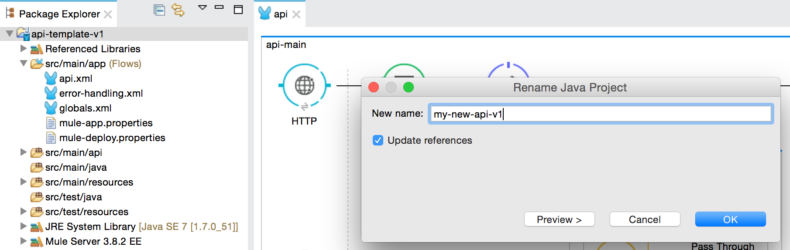
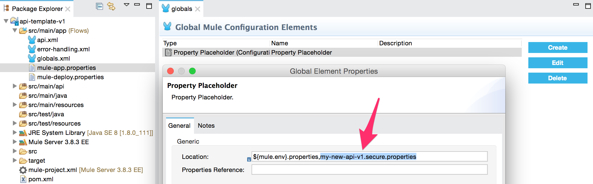
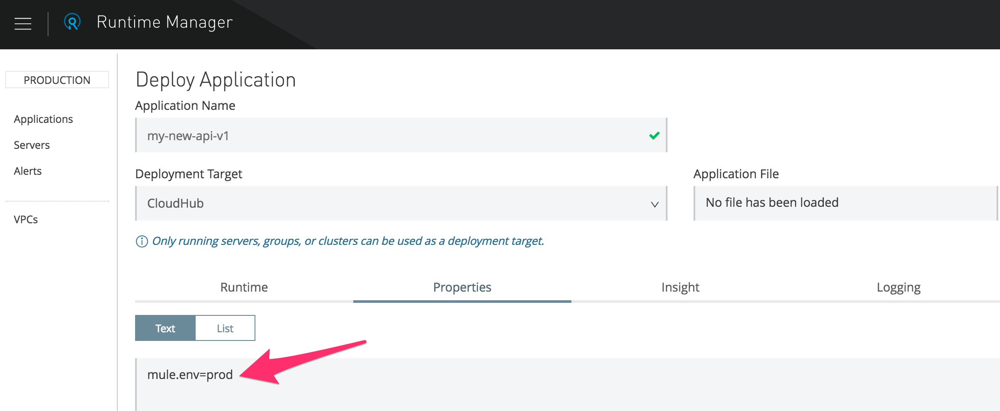
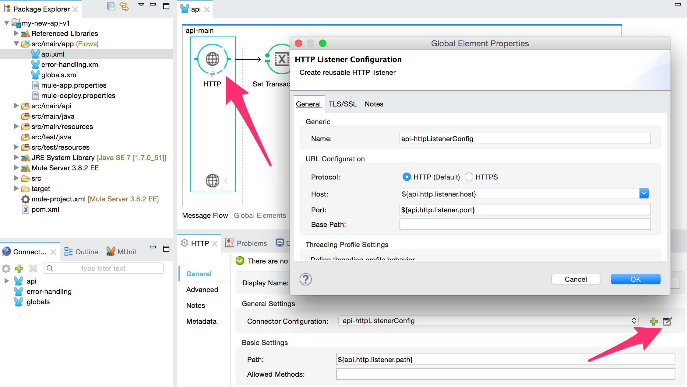
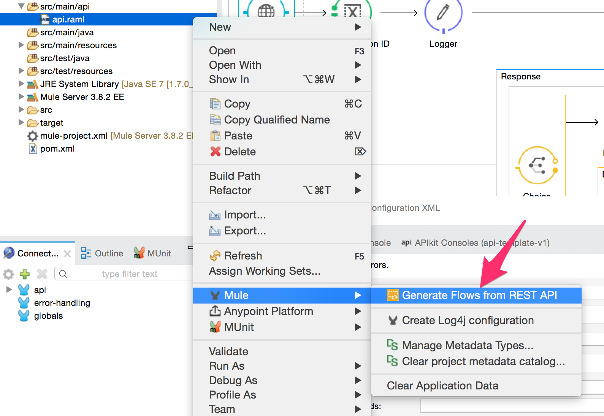
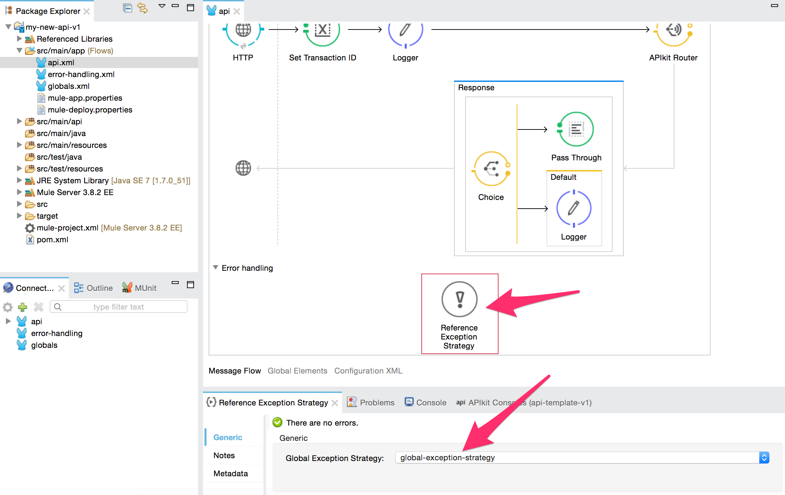
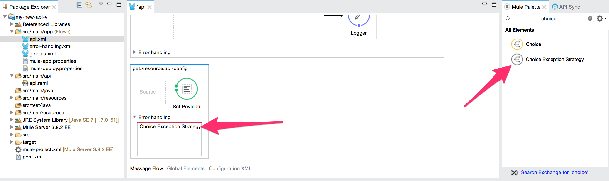
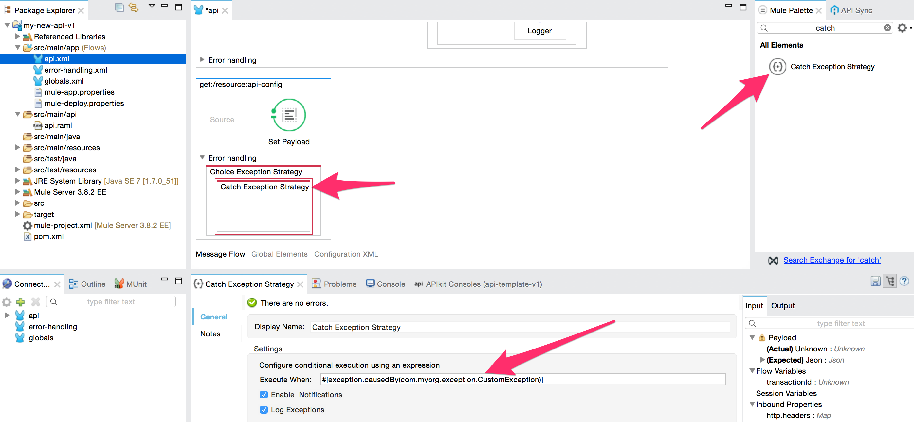
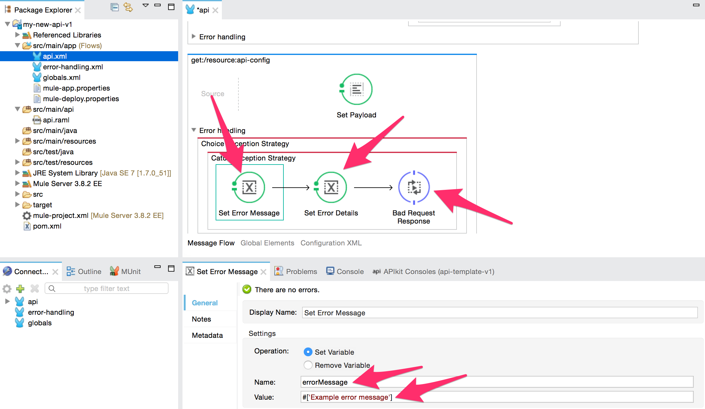
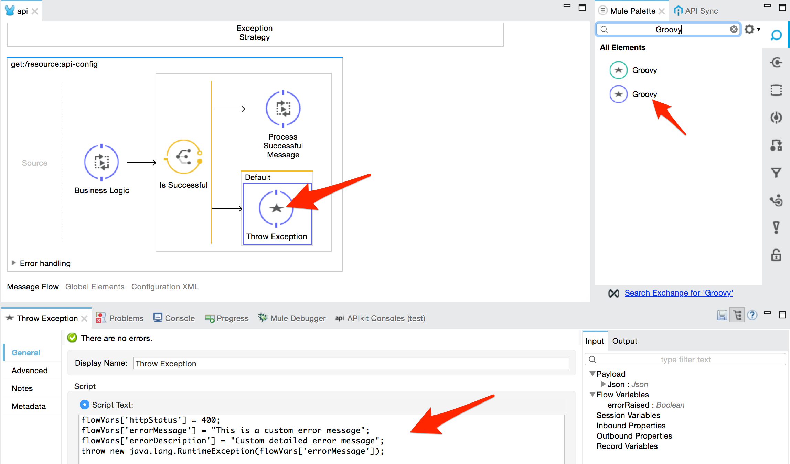

# API Template

## Introduction

This is a generic API template that can be extended based on the use case's needs. It can be used as is or further extended based on the use case's needs. We recommend that it used by the wider community of Mule developers within the Organization.

> **NOTE**: This template is suitable for **RESTful APIs only**. Please use a different template for SOAP-based APIs.

## Description

The API template application should be used every time a new API needs to be implemented. The template pre-implements the following aspects of a Mule API application:

* Properties Configuration
* API Listener (API-Auto-Discovery, HTTP Listener, and APIKit Router)
* Error Handling

Once downloaded into Anypoint Studio, the template can be extended according to the API specifications. Most of the interface specifications would be detailed in the RAML file of the API, which can be used for generating the skeletons of the flows that implement the API operations.

## Installation and Configuration

Use the following software in order to run this template:

* Oracle Java Development Kit (JDK) 1.8
* Apache Maven 3.2.1 or later (ensure Mule EE Repository is setup with credentials)
* Anypoint Studio 6.4.3 or later, including the following extensions:
  * Mule ESB Server Runtime 3.9.0 EE

The project will need to be imported following the POM import wizard. Once the project is imported in Anypoint Studio, it can be configured via its properties configuration files: `local.properties`, `dev.properties`, `qua.properties`, `sit.properties`, and `prod.properties`.

## Basic Customization

The template is designed to be customized. Basic customization should be done every time the template is used for implementing a new API. The steps below detail the actions to take in order to customize the template after it is imported into Anypoint Studio.

(1) Rename the Anypoint Studio project folder from `api-template-v1` to the actual name of your API. In order to rename the project, right-click on the project root folder in Anypoint Studio, then select **Refactor -> Rename** and type the name of your new project (e.g. `my-new-api-v1`). Click **OK** to confirm.



(2) Open `globals.xml` localted in `src/main/app` folder, click on the **Global Elements** tab and double-click on **Properties Placeholder (Configuration)** to update the name of the `api-template-v1.secure.properties` file according to the new project's name (e.g. `my-new-api-v1.secure.properties`).



(3) Open the `pom.xml` file in the Anypoint Studio project to update it with the actual Maven artifact's coordinates. Update `<groupId>` with the actual package name (e.g. `com.mycompany`). Update `<api.build.version>` and `<api.build.application>` properties respectively with the API version and application name set in step 1 (e.g. `v1` and `my-new-api`). Save the `pom.xml` file and let Anypoint Studio re-build the project.


## Properties Configuration

This template comes with a default configuration that supports properties files. The Property Placeholder is contained in the `globals.xml` file under the `src/main/app` folder. The template uses profiles to load the appropriate properties file: `local.properties`, `dev.properties`, `qa.properties`, `sit.properties`, and `prod.properties`. It is possible to switch the profile in Anypoint Studio by double-clicking on `mule-project.xml` file and changing the value of the `mule.env` environment variable.

The `dev.properties`, `qa.properties`, `sit.properties`, and `prod.properties` files are stored under the `src/main/resources` folder and should contain application specific properties. These files **should not contain any sensitive data**, such as passwords or access keys/credentials, because they are supposed to be bundled within the application deployable zip file that is deployed through the Runtime Manager. The kind of properties to store in these properties files can be URLs, ports, timeouts, polling intervals or anything that can be used to configure the behavior of the application.

Also the `local.properties` file is stored under the `src/main/resources` folder. It should be used for development purposes only and it should never be versioned in the source version control system (e.g. GitHub). This properties file is supposed to live in the developer's local environment only (e.g. computer, laptop, etc.), and it can be used for temporarily pointing the developer's local machine to different remote environments without affecting the other properties files or compromising any sensitive data.

> **NOTE**: This template lists `local.properties` in the `.gitignore` file. Therefore, you might need to add your own `local.properties` to the `src/main/resources` folder before launching the template. You can simply start by making a copy of either one of the other properties files and renaming the new file to `local.properties`.

### CloudHub Deployment

When the application is deployed to CloudHub, the environment can be specified by setting the `mule.env` environment variable in the CloudHub "Properties" configuration window. Any sensitive application properties should also be specified at this level.



If your application is deployed via Continuous Integration job, you will need to specify the `mule.env` property along with any sensitive application properties as part of your deployment job. The properties can be specified in the configuration of the [Mule Plugin for Maven](https://docs.mulesoft.com/mule-user-guide/v/3.9/mule-maven-plugin).

```xml
<plugin>
  <groupId>org.mule.tools.maven</groupId>
  <artifactId>mule-maven-plugin</artifactId>
  <version>2.1.1</version>
  <configuration>
    <deploymentType>cloudhub</deploymentType>
    <!-- muleVersion is the runtime version
    as it appears on the CloudHub interface -->
    <muleVersion>3.9.0</muleVersion>
    <region>eu-west-1</region>
    <workers>1</workers>
    <workerType>Micro</workerType>
    <username>username</username>
    <password>password</password>
    <applicationName>my-new-api-v1-prod</applicationName>
    <redeploy>true</redeploy>
    <environment>prod</environment>
    <properties>
      <!-- <mule.env> determines the properties file to load -->
      <mule.env>prod</mule.env>
      <!-- You can append other sensitive application properties
      according to your project's needs -->
    </properties>
  </configuration>
  <executions>
    <execution>
    <id>deploy</id>
    <phase>deploy</phase>
      <goals>
        <goal>deploy</goal>
      </goals>
    </execution>
  </executions>
</plugin>
```

#### CloudHub Secure Properties

Sensitive properties should always be passed through the CloudHub "Properties" configuration window or via the Mule Plugin for Maven in case of automated deployment job. These properties can be secured by using the [Secure Application Properties](https://docs.mulesoft.com/runtime-manager/secure-application-properties) feature in CloudHub. This feature allows you to identify the property names that you wish to secure and list them as `secure.properties` in the `mule-app.properties` file of your application.

In this template there are two properties that have been secured: `anypoint.platform.client_id` and `anypoint.platform.client_secret`. The values of these properties will never be shown on the CloudHub "Properties" window, so that they will be protected from theft.

```
#** GENERATED CONTENT ** Mule Custom Properties file.
#Fri Nov 18 19:48:49 GMT 2016
secure.properties=anypoint.platform.client_id,anypoint.platform.client_secret
```

### On-Premises Deployment

When the application is deployed to an on-premises Mule ESB runtime, the environment does not need to be specified explicitly at deployment time. This is always valid, regardless the fact that the application is deployed manually via the [Runtime Manager](https://docs.mulesoft.com/runtime-manager/) or automatically through Continuous Integration job.

The environment is set at configuration time by the team who performs the runtime installation. They should specify the `mule.env` system variable in the `$MULE_HOME/conf/wrapper.conf` file of the runtime installation (see below).

```
# <n> should be replaced with the correct sequence number
wrapper.java.additional.<n>=-Dmule.env=prod
```

The snippet below shows the configuration of the [Mule Plugin for Maven](https://docs.mulesoft.com/mule-user-guide/v/3.9/mule-maven-plugin) in case of CI deployment to on-premises Mule ESB runtime. As you can see, the `mule.env` property does not need to be specified.

```xml
<plugin>
  <groupId>org.mule.tools.maven</groupId>
  <artifactId>mule-maven-plugin</artifactId>
  <version>2.1.1</version>
  <configuration>
    <deploymentType>arm</deploymentType>
    <username>username</username>
    <password>password</password>
    <businessGroup>My Organization</businessGroup>
    <application>./my-new-api-v1-1.0.0-SNAPSHOT.zip</application>
    <applicationName>my-new-api-v1-prod</applicationName>
    <target>mule-prod-cluster</target>
    <targetType>cluster</targetType>
    <environment>prod</environment>
  </configuration>
  <executions>
    <execution>
    <id>deploy</id>
    <phase>deploy</phase>
      <goals>
        <goal>deploy</goal>
      </goals>
    </execution>
  </executions>
</plugin>
```

#### On-Premises Secure Properties

Sensitive properties should always be stored in a properties file separated from the application bundle. The API Template is configured to look for a properties files that follows the naming convention: `<APP_NAME>.secure.properties`. For example, if my application name is `my-new-api-v1-prod`, the secure properties file will need to be named `my-new-api-v1-prod.secure.properties`.

The secure properties file should be stored under the `$MULE_HOME/conf` folder of the runtime installation prior to deploying the application. This task should be delegated to the Continuous Integration job in case of automated deployment.

When deploying to a Mule cluster, the secure properties files need to be duplicated across all of the Mule ESB nodes. In order to avoid this, the files could be stored in a location shared between the runtime instances. Such location could be added to the classpath of each Mule ESB runtime instance by amending the `$MULE_HOME/conf/wrapper.conf` file as follows.

```
# Java Classpath
wrapper.java.classpath.1=%MULE_LIB%
wrapper.java.classpath.2=%MULE_BASE%/conf
wrapper.java.classpath.3=%MULE_HOME%/lib/boot/*.jar
wrapper.java.classpath.4=<SHARED_LOCATION_PATH>
```

## API Listener

This template provides a pre-built API Listener configuration including an [HTTP Listener](https://docs.mulesoft.com/mule-user-guide/v/3.9/http-listener-connector) and an [APIKit Router](https://docs.mulesoft.com/apikit) pointing to a RAML file (`api.raml`), which is located under the `src/main/api` folder. The template is also provided with an [API Auto-Discovery](https://docs.mulesoft.com/api-manager/api-auto-discovery) global element, which is responsible for registering the API in the [API Manager](https://docs.mulesoft.com/api-manager/).

### API Auto-Discovery

The API Auto-Discovery element can be configured via the two properties showed in the snippet below. It takes the name of the API as defined in the Anypoint Platform, and the API version.

```
# API Configuration
api.name=groupId:8d05377b-112c-43ef-994b-4cd8143e6c79.obd:assetId:my-new-api
api.version=v1:9178295
```

The values for `api.name` and `api.version` properties are taken from the settings section of the API instance configuration page in the API Manager console.

### HTTP Listener Connector

Also the HTTP Listener can be configured via properties file. It is possible to change **host**, **port**, and **base path** on which the API is listening.

The default configuration for the API HTTP Listener provided in this template is showed below. The values should be updated according to the specific project's needs.

```
# API Configuration
api.http.listener.host=0.0.0.0
api.http.listener.port=8081
api.http.listener.path=/api/${api.build.application}/${api.build.version}/*
```

It is possible to change the HTTP Listener Connector configuration by accessing to the connector declared in the `api.xml` file in `src/main/app` folder. Once in the `api.xml` file, double-click on the **HTTP** icon at the beginning of the flow and navigate to the global HTTP Listener Configuration from the properties configuration window.



#### API Gateway Domain (On-Premises Only)

Most often on-premises Mule API applications are associated to a [Mule Domain](https://docs.mulesoft.com/mule-user-guide/v/3.9/shared-resources) specifically created for APIs (API Gateway Domain). The API Gateway Domain's purpose is to ensure that all the APIs deployed within a Mule Runtime instance share the same HTTP listener. In this way all the APIs listen on the same host and TCP port. Using an API Gateway Domain is not mandatory, but in absence of a shared domain, each API needs to be exposed on a different TCP port.

(1) In order to bind your API Template to an API Gateway Domain, [download](../domain/api-gateway) and open the `api-gateway` domain project in Anypoint Studio. Then, in the `api-template-v1` (or whatever API project), double-click on `mule-project.xml` in the project root folder, and select the appropriate API Gateway Domain.


(2) Once the domain is configured in the project, open `api.xml` and update the **Connector Configuration** on the HTTP Listener by selecting `http-lc-0.0.0.0-8081` and save.


(3) Finally, click on **Global Elements** and delete the **HTTP Listener Configuration** from the list of the Global Mule Configuration Elements.


> **NOTE**: Once the HTTP Listener Configuration is deleted the `api.http.listener.host` and `api.http.listener.port` properties will be no longer used. Therefore, it is recommended that such properties are removed from the relevant properties files. An API that is registered to the API Gateway Domain will automatically start listening on host `0.0.0.0` and port `8081`.

### APIKit Router

The APIKit Router is pointing to the `api.raml` file that contains the RAML API specification. This template comes with an example of `api.raml` file, which should be replaced with the actual RAML file of the API that needs to be implemented.

To replace the RAML file, just paste the actual `api.raml` (along with any other JSON or XML resources) in the `src/main/api` folder, and replace the existing `api.raml` when prompted to do so. Once the new `api.raml` is in the Anypoint Studio project, right-click on it and select **Mule -> Generate Flows from REST API**. This will generate the skeletons of the operations that need to be implemented according to the resources specified in the new RAML file.

The skeletons of the flows can be edited in the `api.xml` configuration file, which is placed in the `src/main/app` folder.



The APIKit Router opens by default the [API Console](https://docs.mulesoft.com/apikit/apikit-using#working-with-the-apikit-console) that shows the RAML specification associated to this API. The console can be accessed at the following address `http://localhost:8081/api/v1/console/`, where `http://localhost:8081/api/v1` is the concatenation of the HTTP Listener's **host**, **port**, and **base path**.

The API Console can be disabled by setting the `api.console.enabled` property to `false` (see example below).

```
# API Configuration
api.console.enabled=false
```

## Error Handling

The API Template comes with embedded Error Handling configuration. This ensures that the most common error scenarios are dealt with consistently, and an error response is returned to the caller accordingly.

The Error Handling configuration is specified in the `error-handling.xml` file inside the `src/main/app` folder of the Anypoint Studio project. The configuration includes a global [Choice Exception Strategy](https://docs.mulesoft.com/mule-user-guide/v/3.9/choice-exception-strategy) (`global-exception-strategy`) that wraps a number of different [Catch Exception Strategies](https://docs.mulesoft.com/mule-user-guide/v/3.9/catch-exception-strategy), which are executed based on the exception thrown at run time.

The global Choice Exception Strategy is set on the `api-main` flow inside the `api.xml` file. This ensures that every exception thrown is always caught and dealt with.



### Error Message

Every time an exception is thrown, the Error Handling configuration collects the error information and generates an error response message accordingly. An example of error message is provided below.

```json
{
  "error": {
    "errorCode": "BAD_GATEWAY",
    "errorDateTime": "2016-22-10T20:16:45+0000",
    "errorMessage": "Upstream service unable to fulfil request.",
    "errorDescription": "The request was not validated."
  }
}
```

The table below describes all the fields that are returned in the error response JSON message.

| Field Name         | Description | Mandatory |
| ------------------ | ----------- | --------- |
| `errorCode`        | Contains the reason associated to the returned HTTP status code (e.g. `BAD_GATEWAY` for response code `502`). | Yes |
| `errorDateTime`    | Timestamp of when the error has occurred. | Yes |
| `errorMessage`     | High level description of the error occurred within the context of the `errorCode` provided. | No |
| `errorDescription` | Detailed description of the error cause when applicable. | No |

### Extending Error Handling

If an exception is thrown and a match on the exception type is not found, the configuration generates a default error message that is returned to the caller along with `500` HTTP response status code. However, the Error Handling configuration can be extended to include other types of exception by just adding another Catch Exception Strategy to the list of the exception strategies in the global Choice Exception Strategy.

### Using Error Handling

It is possible to catch an exception in any parts of the application and generate an error response by using the Error Handling framework.

In order to do so, drag a **Choice Exception Strategy** scope into the **Error Handling** section of the flow for which you want to catch the exception.



Once the Choice Exception Strategy scope is positioned, drag a **Catch Exception Strategy** scope inside the Choice Exception Strategy scope and use [Mule Expression Language (MEL)](https://docs.mulesoft.com/mule-user-guide/v/3.9/mule-expression-language-mel) to evaluate the exception type.



Inside the Catch Exception Strategy, you can configure the logic to generate the custom error response according to the type of exception that has been thrown. The error response can be customized by setting the `errorMessage` and `errorDescription` flow variables using a [Variable Transformer](https://docs.mulesoft.com/mule-user-guide/v/3.9/variable-transformer-reference). The error message can be finally generated by using a [Flow Reference Component](https://docs.mulesoft.com/mule-user-guide/v/3.9/flow-reference-component-reference) that points to one of the pre-built sub flows declared in the `error-handling.xml` configuration file (e.g. `global-resource-not-found-response-sub-flow`). The sub flow ensures that the error response is generated including the appropriate HTTP status code and JSON payload.



The API Template includes the following error response sub flows. Further error response sub flows can be added by just cloning an existing one and changing the **Set Status** and **Set Error Code** components' configuration.

| Sub Flow Name                                     | Error Code               | HTTP Status Code |
| ------------------------------------------------- | ------------------------ | ---------------- |
| `global-bad-request-response-sub-flow`            | `BAD_REQUEST`            | `400`            |
| `global-resource-not-found-response-sub-flow`     | `RESOURCE_NOT_FOUND`     | `404`            |
| `global-method-not-allowed-response-sub-flow`     | `METHOD_NOT_ALLOWED`     | `405`            |
| `global-not-acceptable-response-sub-flow`         | `NOT_ACCEPTABLE`         | `406`            |
| `global-conflict-response-sub-flow`               | `CONFLICT`               | `409`            |
| `global-unsupported-media-type-response-sub-flow` | `UNSUPPORTED_MEDIA_TYPE` | `415`            |
| `global-internal-server-error-response-sub-flow`  | `INTERNAL_SERVER_ERROR`  | `500`            |
| `global-bad-gateway-response-sub-flow`            | `BAD_GATEWAY`            | `502`            |

Since the Catch Exception Strategy is defined inside a Choice Exception Strategy scope, Mule evaluates the expression defined in the Catch Exception Strategy and if a match is found, the logic inside the Catch Exception Strategy block is executed, otherwise the exception is propagated to the parent flow (i.e. `api-main`), which passes the exception to the global Choice Exception Strategy defined in the `error-handling.xml` configuration file. The global Choice Exception Strategy is executed and if a match is not found, the default error message is generated.

### Raise Custom Exceptions

It is possible to generate custom errors anywhere in the application flows by just using a Groovy Script Component. The snippet below will need to be used inside the Groovy Script Component. The values of the flow variables can be changed according to the use case needs.

```
flowVars['httpStatus'] = "400";
flowVars['errorMessage'] = "This is a custom error message";
flowVars['errorDescription'] = "Custom detailed error message";
throw new java.lang.RuntimeException(flowVars['errorMessage']);
```



## Transaction ID

When this API Template is invoked, it automatically looks for an `X-Transaction-ID` custom header in the HTTP inbound request. If the header is found, its value is saved in the `transactionId` flow variable. If such header is not found, the template populates the `transactionId` flow variable with a UUID. The Transaction ID can be accessed from any parts of the application using the following Mule expression: `#[flowVars.transactionId]`.


The Transaction ID is used for tracking all the API requests, and it is printed in the application's log upon:

* Incoming request (in this case the application also prints the accessed resource)
* Successful response sent to the caller
* Error response sent to the caller (in this case the application also logs the error details)

```
INFO  2017-04-04 12:58:11,477 Audit: { "transaction": "0e01a706797045a399300d08fad69eec", "request": "GET /api/v1/resource" }
INFO  2017-04-04 12:58:11,547 Audit: { "transaction": "0e01a706797045a399300d08fad69eec", "response": "200" }
```

The Transaction ID can be useful for troubleshooting API calls across different APIs. For example, a client API can pass the Transaction ID to another API, and since the ID gets logged in both the applications' logs, it is possible to use such ID for correlating all the API calls within the same business transaction.

> **NOTE**: Using transaction IDs to track API calls is an optional approach and this template does not force users to adopt it. However, MuleSoft recommends that this approach (or similar) is used for increasing the governance over the business transactions that are processed through the [Application Network](https://www.mulesoft.com/lp/whitepaper/api/application-network).
